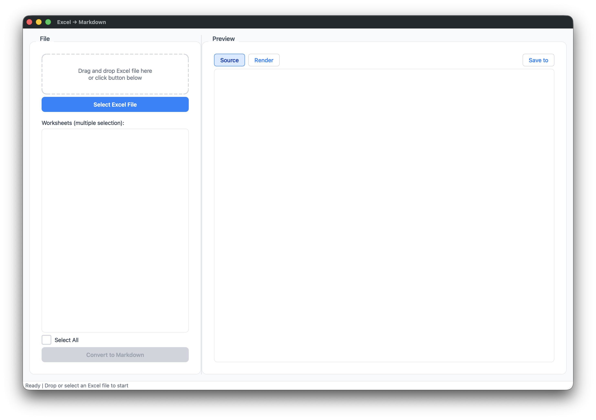
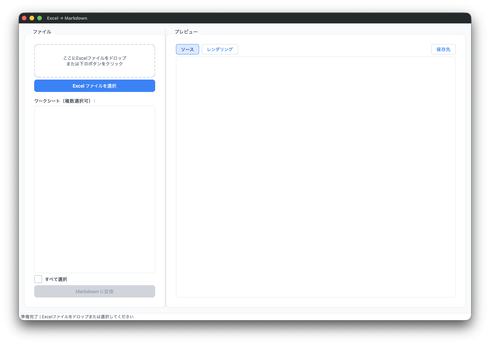

# UMDoc -> Markdown

> **语言**：简体中文 | [English](README_en.md) | [日本語](README_ja.md)

一个跨平台（Windows & macOS）的现代桌面工具，可将几乎所有常见文档一键转换为结构清晰的 Markdown 文本。
基于微软开源的 MarkItDown 引擎，并安装了 [all] 全量依赖，支持 Office、PDF、图像、音频、电子书等 30+ 文件格式。

## 特性

- 万能转换：支持 Word、Excel、PowerPoint、PDF、图片、音频、EPUB、HTML、CSV、JSON 等多种格式，均可转为 Markdown。
- 拖拽即用：直接拖入文件或通过按钮选择，自动识别格式并完成转换。
- 智能 Excel 处理：当文件为 Excel 时，自动显示工作表列表，可自由勾选需要转换的工作表；其他格式则自动隐藏该选项，保持界面简洁。
- 双视图预览：可在“源码”和“渲染”模式间快速切换，所见即所得。
- 保存灵活：支持“保存 Markdown 文件”以及“保存到指定文件夹”（自动以原文件名生成 .md 文件）。
- 现代简洁界面：采用浅色主题，圆角卡片设计，视觉舒适。
- 多语言自动适配：启动时自动检测系统语言，支持中文、日本語、English，也可在菜单中手动切换。
- 环境自动管理：通过 launcher.py 一键安装所需全部依赖（PySide6、markitdown[all] 等），所有包安装于项目目录的独立虚拟环境中，不污染系统 Python。

## 截图






## 快速开始

### 前置条件

- Python 3.9+
  macOS 建议通过 Homebrew 安装：brew install python
  Windows 可从 python.org 下载

### 安装与运行

1. 克隆仓库
   ```
   git clone git@github.com:PacteraSunChao/umdoc.git
   cd umdoc
   ```

2. 通过启动器运行（推荐）
   ```
   python3 launcher.py
   ```
   首次运行会自动在项目目录创建虚拟环境 app_env，并安装所有依赖（PySide6 和 markitdown[all] 等）。
   之后运行会直接启动主界面，无需重复安装。

3. 或手动安装依赖并运行主程序
   ```
   python3 -m venv app_env
   source app_env/bin/activate   # macOS/Linux
   app_env\Scripts\activate    # Windows
   pip install PySide6 "markitdown[all]"
   python3 umdoc.py
   ```

### 使用说明

- 启动后，拖拽任意支持的文件（如 .docx、.pdf、.xlsx、.jpg 等）到“文件”区域，或点击按钮选择。
- 如果是 Excel 文件，右侧会显示工作表列表，可勾选需要转换的工作表（支持全选/取消全选），然后点击“转换为 Markdown”。
- 对于其他格式，程序会自动转换并在预览区展示结果。
- 使用“源码”和“渲染”按钮切换查看模式。
- 点击“保存到”选择一个文件夹，应用会自动以原文件名生成 .md 文件；也可通过菜单栏“文件 -> 保存 Markdown”手动命名保存。

## 支持的文件格式

通过 markitdown[all] 安装全量依赖后，本工具可处理以下常见文件类型：

| 类别 | 格式 |
| :--- | :--- |
| Office 文档 | .docx, .pptx, .xlsx, .xls |
| PDF | .pdf |
| 图像 | .jpg, .png 等（支持 OCR 提取文字） |
| 音频 | .wav, .mp3（需配合 Azure AI 语音服务） |
| 电子书 | .epub |
| 网页与数据 | .html, .csv, .json, .xml |
| 压缩包 | .zip（自动解压并转换其中可识别文件） |
| 邮件 | .msg (Outlook 邮件) |
| 其他 | YouTube 链接（可转换为带描述的 Markdown） |

注：音频转录、YouTube 链接解析等高级功能需要额外配置 Azure AI 或 LLM 客户端（例如 OpenAI）。在不配置的情况下，MarkItDown 仍会提取可用的元数据信息。

## 项目结构

```
.
├── launcher.py          # 启动引导器（自动创建虚拟环境并安装依赖）
├── umdoc.py             # 主程序（GUI 界面与转换逻辑）
├── README.md            # 项目说明
└── .gitignore           # 版本忽略规则
```

## 技术栈

- PySide6 - 跨平台 GUI 框架
- MarkItDown - 微软开源的文档转 Markdown 引擎
- openpyxl - Excel 文件读取（用于获取工作表列表）
- 其他由 markitdown[all] 自动安装的 PDF、图像处理、HTML 解析等库

## 多语言

应用支持中文、日本語、English 三种界面语言。
启动时根据系统语言自动选择，你也可以在菜单栏 语言 / Language / 言語 中随时切换。

## 贡献

欢迎提交 Issue 和 Pull Request 来改进这个工具。
如果你有新的功能想法或发现了 bug，请在 GitHub Issues 中提出。

## 许可证

本项目采用 MIT License 开源，允许自由使用、修改和分发。详见 LICENSE 文件。
